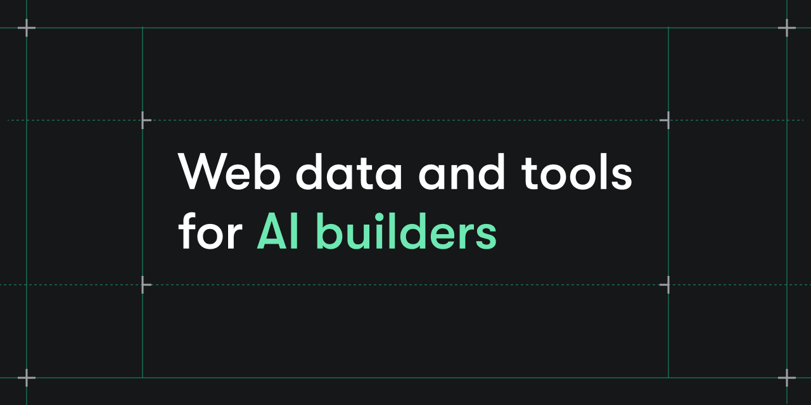

 

    
     
     
    <b>Apify is the largest ecosystem where developers build, deploy, and publish data extraction and web automation tools. We call them Actors.</b>

<h4 align="center">
  
  
   
  
</h4>

<h2>Learn About Apify 🧑‍🎓</h2>

<ul>
    <li>Find hundreds of ready-made Actors for your web scraping or automation project on <a href="https://apify.com/store/">Apify Store.</a></li>    
    <li>Learn everything about web scraping and automation with our <a href="https://docs.apify.com/academy/">free courses</a> that will turn you into an expert scraping developer.</li>
    <li>Publish your web scrapers as  <a href="https://https://apify.com/partners/actor-developers/">paid Actors</a> on the Apify platform, attract people who need these solutions, and get regular passive income.</li>
    <li>View our livestreams and video content at the <a href="https://youtube.com/c/Apify">Apify YouTube channel</a>.</li>
    <li>Learn more through tutorials and thought leadership content about web scraping on <a href="https://blog.apify.com/">Apify Blog</a> and <a href="https://crawlee.dev/blog/">Crawlee Blog</a>.</li>
</ul>

<h2>We are hiring! 🕸️</h2>

Check out the [open positions](https://apify.com/jobs) at Apify and help us make the web more programmable.
