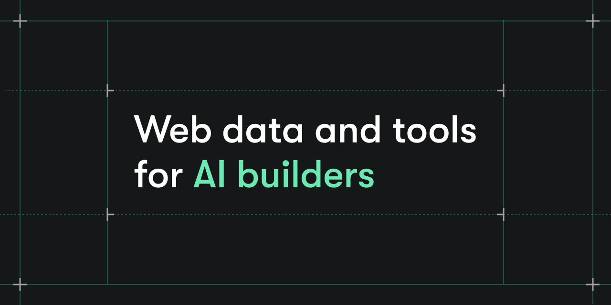

 

    
     
     
    <b>Apify is the largest marketplace of tools for AI. Thousands of ready-to-run tools get web data, automate tasks on the web, and give your agents real-time context. We call them Actors.</b>

<h4 align="center">
  
  
   
  
</h4>

<h2>Learn About Apify 🧑‍🎓</h2>

<ul>
    <li>Find an Actor for your web scraping or automation project on <a href="https://apify.com/store/">Apify Store</a>.</li>
    <li>Build your own Actors, publish them to <a href="https://apify.com/store/">Apify Store</a>, and earn passive income when others use them.</li>
    <li>Connect your AI agents to the web with the <a href="https://mcp.apify.com/">Apify MCP server</a>.</li>
    <li>Build reliable crawlers with <a href="https://crawlee.dev/">Crawlee</a>, Apify's open-source library for JavaScript and Python.</li>
    <li>Learn web scraping and automation with the free courses at <a href="https://docs.apify.com/academy/">Apify Academy</a>.</li>
    <li>Publish your web scrapers as  <a href="https://apify.com/partners/actor-developers/">paid Actors</a> on the Apify platform, attract people who need these solutions, and get regular passive income.</li>
    <li>Watch livestreams and tutorials on the <a href="https://youtube.com/c/Apify">Apify YouTube channel</a>.</li>
    <li>Read guides and deep dives on <a href="https://blog.apify.com/">Apify Blog</a> and <a href="https://crawlee.dev/blog/">Crawlee Blog</a>.</li>
</ul>

<h2>We are hiring! 🕸️</h2>

Check out the [open positions](https://apify.com/jobs) at Apify and help us make the web more programmable.
